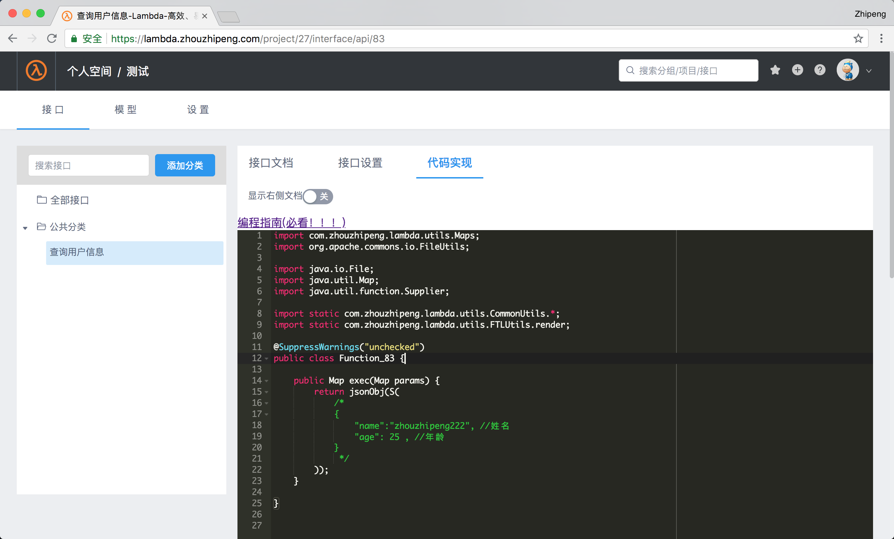
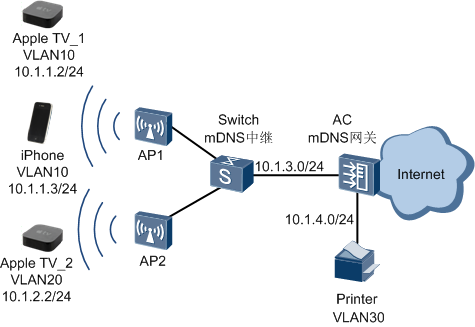
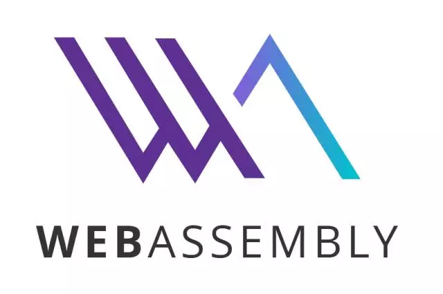
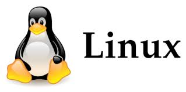

>不疯魔不成活

### 最新文章

#### [Redis内存空间简单分析](articles/redis-memory-analysis.md )

> 最近发现项目中用的`redis` 内存消耗很大（但是印象中却以为没有这么多的key的内存消耗才对呀？），使用`info`命令可以看到所有key占用的一些内存大小以及key的数量等等，如下图所示(只截图了memory和ke…

---

#### [【视频分享】CodingAir云服务开发平台使用及介绍](articles/codingair-share-video.md )

> youtube地址：https://youtu.be/rJYOiO00tnw 爱奇艺地址： http://www.iqiyi.com/w_19s354u9f5.html …

---

#### [如果java也有多行字符串该多好？！](articles/what-if-there-is-multiline-string-in-java.md )

> java可以做很多事情，但是却一直没有“多行字符串”这种特性或语法，实在是很不方便，难道我们就只能这样妥协屈服吗？…

---

#### [CodingAir云服务开发平台-EMap使用技巧](articles/codingair-emap-tips.md )

> CodingAir云服务开发平台上线啦！地址：http://codingair.com 欢迎大家免费试用提意见哦！（测试账号：823143047@qq.com （我的邮箱） 密码：123456 , 也可以自行注册哦！) …

---

#### [巧用SublimeText和正则表达式，让操作飞起来！](articles/when-sublimetext-meet-regexp.md )

> SublimeText 是一款mac上的文本编辑器，类似于windows上的notepad++或者editplus等。正则表达式是对文本进行查找、替换等处理的规则表达式.两者的结合会擦出怎样的火花呢？ …

---

#### [CodingAir云服务开发平台-CommonUtils](articles/lambda-platform-commonutils.md)

> CodingAir云服务开发平台上线啦！地址：http://codingair.com 欢迎大家免费试用提意见哦！（测试账号：823143047@qq.com （我的邮箱） 密码：123456 , 也可以自行注册哦！) …

---

#### [CodingAir云服务开发平台-可用的maven依赖](articles/lambda-available-maven-dependencies.md)

> CodingAir云服务开发平台上线啦！地址：http://codingair.com 欢迎大家免费试用提意见哦！（测试账号：823143047@qq.com （我的邮箱） 密码：123456 , 也可以自行注册哦！) …

---

#### [CodingAir云服务开发平台使用帮助](articles/lambda-platform-help.md)

> CodingAir云服务开发平台上线啦！地址：http://codingair.com 欢迎大家免费试用提意见哦！（测试账号：823143047@qq.com （我的邮箱） 密码：123456 , 也可以自行注册哦！) …

---

#### [微服务下无侵入式动态路由数据库](articles/dynamic-datasource-in-rpc.md)

> 如何无侵入的按key进行数据库路由?这里的“无侵入”涉及到两个难点：1. web调service的时候如何可以不传入appkey 却将appkey带到service端？ 2. 假设第一点ok，service端又如何能不显…

---

#### [ mDNS协议应用场景研究汇总](articles/mdns-protocol-study-collect.md)

> mDNS multicast DNS , 使用5353端口，组播地址 224.0.0.251。在一个没有常规DNS服务器的小型网络内，可以使用mDNS来实现类似DNS的编程接口、包格式和操作语义。MDNS协议的报文与DN…

---

#### [【未解决】在docker里面安装teamviewer ？](articles/install-teamviewer-in-docker.md)

> 简介 最近跟远程桌面较上劲了！ 目前在docker里面装vnc服务器的方案是有的，而且用起来还可以， 但是帧率很低，即时在网速很好的情况下，仍然感觉画面撕裂较严重。 相比而言，在用过teamviewer之后，发现这玩意简…

---

#### [【未解决】在Kubernetes 上部署Spark遇到的一些问题？](articles/problems-on-deploying-spark-on-k8s.md)

> 简介 这是一篇学习spark的笔记类的文章，途中遇到了问题，先简单记录下来，问题虽然还没解决，但是后面解决了会持续更新下的。 正文 最近在学习spark，感觉阻力还是不少，听说最新的spark 2.3.0 可以直接跑在 …

---

#### [走近WebAssembly之调试大法](articles/debug-webassembly.md)

> WebAssembly or wasm is a new portable, size- and load-time-efficient format suitable for compilation to the we…

---

#### [时序数据库InfluxDB初体验](articles/influx-db-first-experience.md)

> 什么是时间序列数据？最简单的定义就是数据格式里包含timestamp字段的数据。比如股票市场的价格，环境中的温度，主机的CPU使用率等。但是又有什么数据是不包含timestamp的呢？几乎所有的数据都可以打上一个time…

---

#### [ docker on mac 无法启动或者启动后自动又退出了原因](articles/docker-on-mac-wu-fa-qi-dong-huo-zhe-qi-dong-hou-zi-dong-you-tui-chu-liao-yuan-yin.md)

> 用过很长一段时间后，上面的虚拟磁盘镜像大小会打满！！！ 比如 之前设置的64G ,后来用的超过了64G了！！ 这个时候docker无法启动，尝试多次启动后还是会自动退出，后来发现如下设置：...

---

#### [微服务框架之dubbo入门视频分享](articles/wei-fu-wu-kuang-jia-zhi-dubbo-ru-men-shi-pin-fen-xiang.md)

> youtube https://youtu.be/rGLKN_RVl0E 优酷 http://v.youku.com/v_show/id_XMzQ1NjE4MTA5Ng==.html?spm=a2h3j.8428770.…

---

#### [玩转docker之multi-stage build分享视频](articles/docker-multi-stage-build-share-video.md)

> ppt下载 youtube https://youtu.be/LHfyNqDB9tY 爱奇艺 http://www.iqiyi.com/w_19rxalo1y5.html…

---

#### [用Dockerfile打造你的自动化构建工具](articles/dockerfile-auto-ci-tool.md)

> 自动化构建是应用发布过程中必不可少的环节， 使用docker提供的multi-stage build功能能让你的应用构建更加高效快捷。…

---

#### [巧用Docker Volume：数据备份的新潮流！](articles/tips-for-docker-volume-backup.md)

> 使用docker volume 作为数据库数据备份的新方式。容器化的时代确实来了，有状态的数据库容器、无状态的应用容器，在docker化的世界里争相斗艳！你可以保留传统的操作方式、运维模式，但请不要拒绝任何能提升生产力，…

---

#### [抢先体验java10的新特性之jdk源码仓库统一](articles/java10-features-merge-repo.md)

> java10即将推出！抢先来体验下java10的一些新特性吧! 本文将着重介绍：jdk代码仓库合并为一个仓库，此特性主要是解决jdk源码仓库内部维护问题，jdk的八个主要代码仓库将合并为一个单一的综合仓库，...

---

#### [抢先体验java10的新特性之局部变量类型推断](articles/java10-features-local-variable-infer.md)

> java10即将推出！抢先来体验下java10的一些新特性吧! 本文将着重介绍：局部变量类型推断，从此java也可以跟其他动态语言一样，声明变量的时候不用每次都写冗长的类型名称了！...

---

#### [【译】Java9 (Part 1): 从零开始了解“模块化”](articles/java-9-tutorial-step-by-step-from-zero-to-modules.md)

> 翻译自原文：https://dzone.com/articles/java-9-tutorial-step-by-step-from-zero-to-modules 我们都知道为什么模块是非常重要的。模块是微服务的基石！…

---

#### [centos7 安装docker-ce](articles/install-docker-on-centos7.md)

> 参考：https://yq.aliyun.com/articles/110806?spm=a2c1q.8351553.0.0.13514d2akQz8f2 # step 1: 安装必要的一些系统工具 sudo yum i…

---

#### [java 9 学习笔记 1](articles/java-9-notebook-1.md)

> java9 无法通过类加载器加载jar中的资源文件 注意上图中的差异处，java9 跟java8差别还是非常大的， 所以开中中要特别注意这点。…

---

#### [svn迁移到git 操作指南](articles/migrate-svn-to-git-guide.md)

> 前言 本操作指南假设你对git以及svn已经有些了解，从svn无缝迁移到gitlab私有仓库中， 将保留所有提交的commits以及提交的log 等。 在gitlab中新建对应名称的项目 请注意建好group，并在pro…

---

#### [Docker 私有仓库搭建](articles/install-docker-private-registry.md)

> docker安装配置 # 安装docker环境 curl -sSL https://get.daocloud.io/docker | sh # 安装docker镜像加速器 curl -sSL https://get.da…

---

#### [linux系统上安装rz/sz 软件](articles/install-rzsz-in-linux.md)

> 有时候我们经常性的需要在linux机上上传或下载小文件之类的，这个时候通常的做法是开一个ftp软件进行传输，但是有时候比较麻烦， 一般另外一种比较好的方式是使用 rz sz 命令直接上传或者下载。 以下操作在Secure…

---

#### [走进docker的世界之入门篇](articles/walk-in-docker-beginning.md)

> 视频地址 http://www.iqiyi.com/w_19rv53wrz9.html 什么是docker Docker 是一个开源的应用容器引擎，让开发者可以打包他们的应用以及依赖包到一个可移植的容器中，然后发布到任何…

---

#### [薅羊毛系列之蜘蛛网电影抢票分析](articles/crack-serials-spider-movie.md)

> 说明：以下内容从我的个人博客 blog.zhouzhipeng.com 复制过来，两边同步发布。 首先声明一下，这里并不是给蜘蛛网打广告。自己平时也比较喜欢看电影，刚好蜘蛛网电影app上有一个周六建行5元抢票活动，由于活…

---

### 声明
> 本博客遵循CC协议2.5，即署名-非商业性使用-相同方式共享。
  写作很辛苦，转载请注明作者以及原文链接。
  如果你喜欢我的文章，你可以收藏我的博客 :)
  