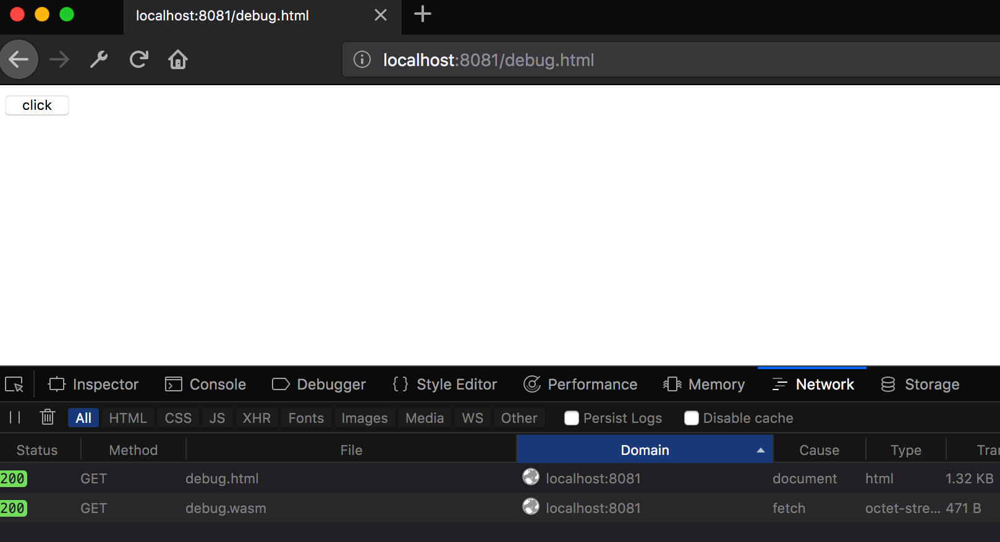
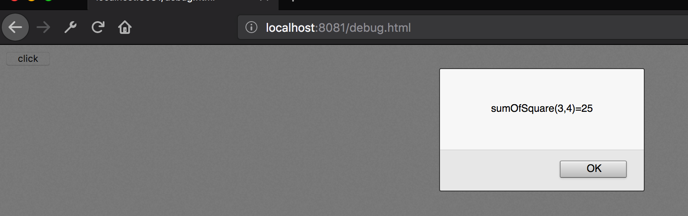
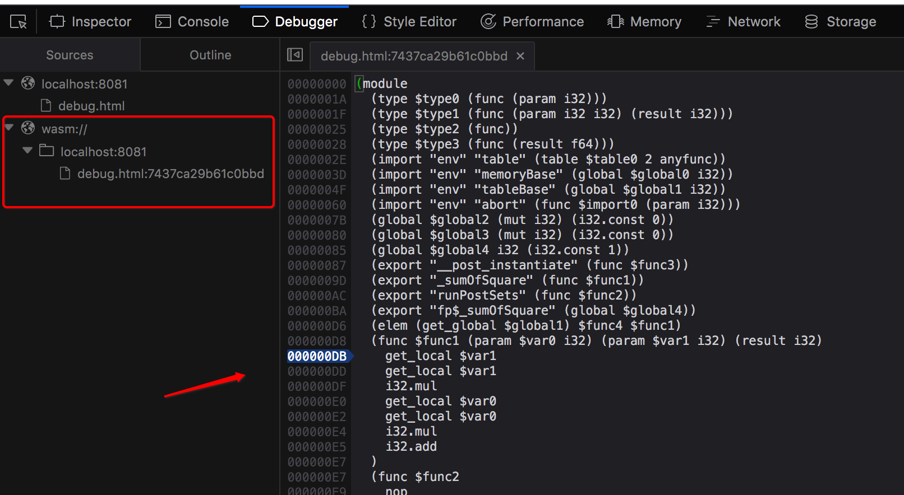
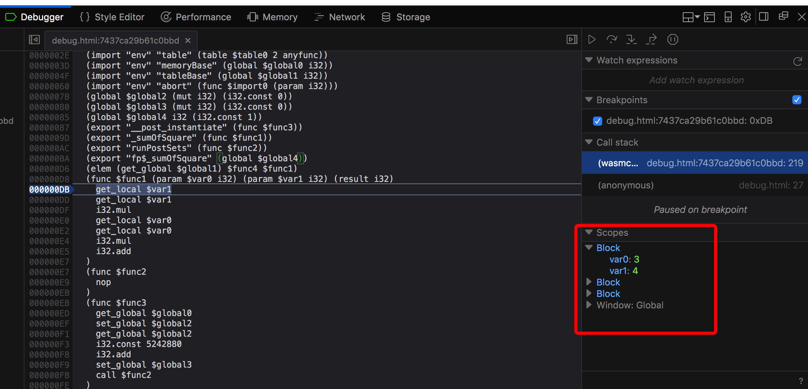
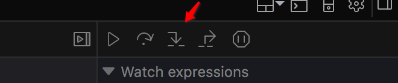
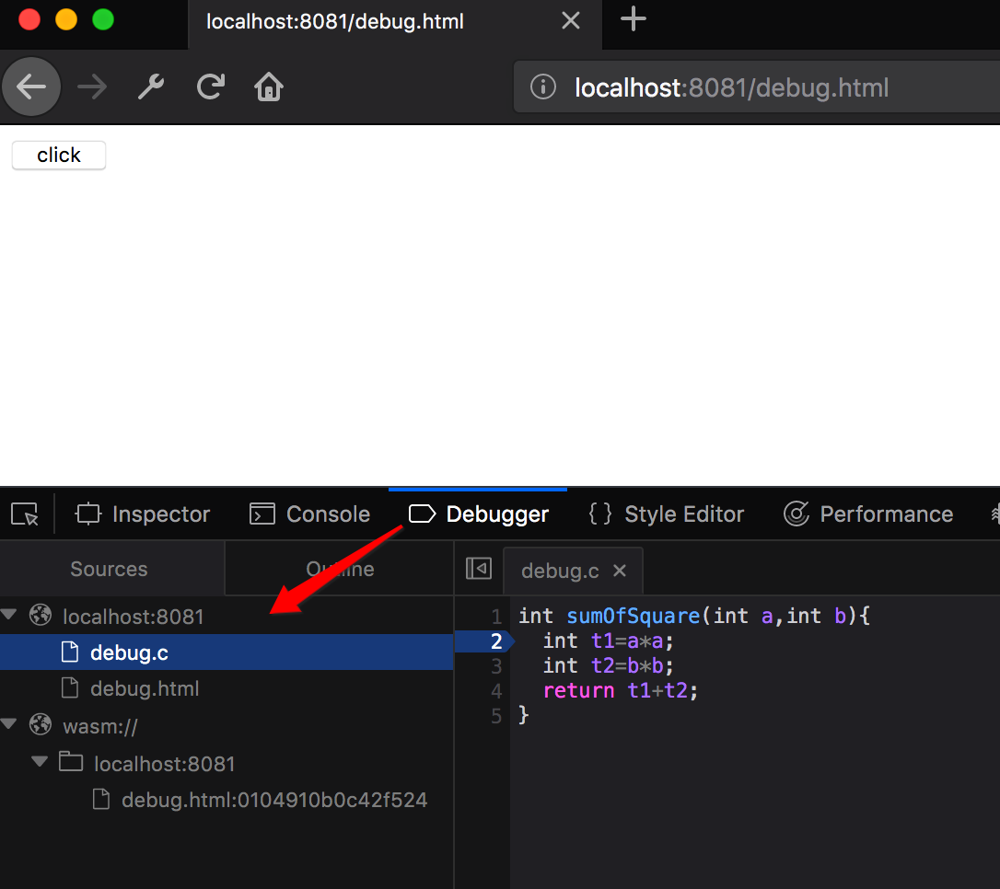
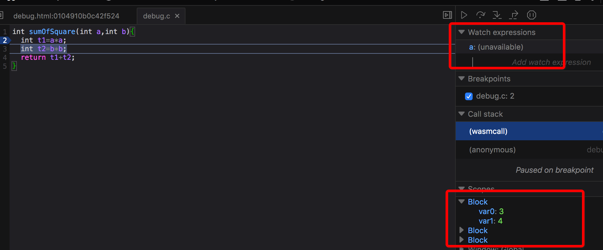
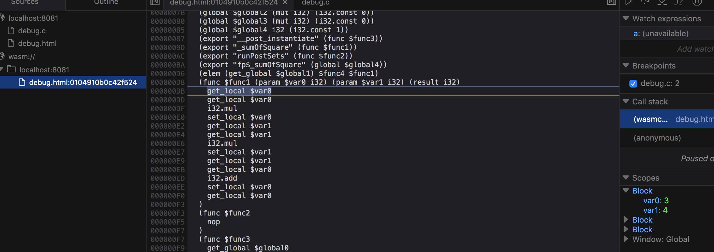

# 走近WebAssembly之调试大法


## 前言

### WebAssembly是什么？

下面是来自官方的定义：

> WebAssembly or wasm is a new portable, size- and load-time-efficient format suitable for compilation to the web.

关键词：**”format"**，WebAssembly 是一种编码格式，适合编译到web上运行。

事实上，WebAssembly可以看做是对JavaScript的加强，弥补JavaScript在执行效率上的缺陷。

- 它是一个新的语言，它定义了一种AST，并可以用字节码的格式表示。
- 它是对浏览器的加强，浏览器能够直接理解WebAssembly并将其转化为机器码。
- 它是一种目标语言，任何其他语言都可以编译成WebAssembly在浏览器上运行。

想象一下，在计算机视觉，游戏动画，视频编解码，数据加密等需要需要高计算量的领域，如果想在浏览器上实现，并跨浏览器支持，唯一能做的就是用JavaScript来运行，这是一件吃力不讨好的事情。而WebAssembly可以将现有的用C，C++编写的库直接编译成WebAssembly运行到浏览器上, 并且可以作为库被JavaScript引用。那就意味着我们可以将很多后端的工作转移到前端，减轻服务器的压力。这是WebAssembly最为吸引人的特性。并且WebAssembly是运行于沙箱中，保证了其安全性。


更多关于WebAssembly基础入门, 可以看下这篇文章：https://segmentfault.com/a/1190000012110615，  写得很详细。


（后文将主要使用`wasm` 名称表示 WebAssembly)


### 怎么调试?

稍微了解`javascript` 的人应该知道，在chrome或者firefox的开发者面板中可以很方便对js代码加断点、查看变量、单步执行等等，非常方便！


既然`wasm`主要是运行在web浏览器上的（当然也可以在非web环境中运行，参见官方文档描述：http://webassembly.org/docs/non-web/），主要的调试方式无非是使用开发者控制台了！

但问题在于上文中说了 `wasm` 是一种二进制格式，虽然有可读的文本格式`wast`，但是调试起来依然比较费劲，最主要的问题是：**你是不是更想能够调试被编译之前的`c/c++` 源代码?**


## 调试探索

搜了很多资料，走了不少弯路，总算是摸索出一条可行的调试之路！（当然如果你有更好的调试方法，请告诉我哦！?）


### 环境&工具准备

* wasm编译环境 [docker](https://blog.zhouzhipeng.com/walk-in-docker-beginning.html)版 , [镜像 zhouzhipeng/wasm-build](https://hub.docker.com/r/zhouzhipeng/wasm-build/)
* Firefox最新开发者版， [下载地址](https://www.mozilla.org/en-US/firefox/developer/)
* 文本编辑器

说明：如果你想定制自己的wasm编译环境[docker](https://blog.zhouzhipeng.com/walk-in-docker-beginning.html)镜像，强烈建议在ubuntu中参考官方文档步骤搭建： [ http://webassembly.org/getting-started/developers-guide/ ](http://webassembly.org/getting-started/developers-guide/ )


### 实验代码准备

github地址：[https://github.com/zhouzhipeng/wasm-debug-test](https://github.com/zhouzhipeng/wasm-debug-test)


1. 编写一个简单的c程序，求两个数的平方和

**debug.c**

```c
int sumOfSquare(int a,int b){
	int t1=a*a;
	int t2=b*b;
	return t1+t2;
}
```


2. 编译debug.c ---> debug.wasm

使用上节中的docker镜像: [ zhouzhipeng/wasm-build](https://hub.docker.com/r/zhouzhipeng/wasm-build/)

```bash
#1.先运行wasm编译docker容器 (镜像托管在docker官方hub，可能会比较慢，请耐心等待)
➜  wasm-debug-test git:(master) ✗ docker run -it --name wasm-test -v $(pwd):/data/ zhouzhipeng/wasm-build bash

#2.编译debug.c为debug.wasm 文件
root@f4d3ee71bec8:/data# cd /data/
root@f4d3ee71bec8:/data# emcc debug.c -O1 -s WASM=1 -s SIDE_MODULE=1 -o debug.wasm
```

说明：关于`emcc` 命令细节，可以参考：[http://kripken.github.io/emscripten-site/docs/compiling/WebAssembly.html](http://kripken.github.io/emscripten-site/docs/compiling/WebAssembly.html)


3. 编写测试页面

说下大致逻辑：页面加载时会加载`debug.wasm` 文件并初始化，给页面上的按钮绑定click事件，点击时调用上面`debug.c`中的 `sumOfSquare` 函数。

**debug.html**

```html
<html>
<head>
  <script>
    // 下面这些配置是作为wasm初始化用的，去掉某一个会报错。
    const importObj = {
        env: {
            memory: new WebAssembly.Memory({initial: 256, maximum: 256}),
            memoryBase: 0,
            tableBase: 0,
            table: new WebAssembly.Table({initial: 10, element: 'anyfunc'}),
            abort:function(){}
        }
    };


  // 直接使用  WebAssembly.instantiateStream的方式会报错，说是 debug.wasm 资源不是 application/wasm 格式s.
  fetch('./debug.wasm').then(response =>
    response.arrayBuffer()
  ).then(bytes => WebAssembly.instantiate(bytes,importObj)).then(results => {
    instance = results.instance;
    var sumOfSquare= instance.exports._sumOfSquare;  //注意这里导出的方法名前有下划线!!

     var button = document.getElementById('run');
     button.addEventListener('click', function() {
          var input1 = 3;
          var input2 = 4;
          alert('sumOfSquare('+input1+','+input2+')='+sumOfSquare(input1,input2));
     }, false);
  });

  </script>
</head>
<body>
  <input type="button" id="run" value="click"/>
</body>
</html>
```


4. 运行查看效果

为了简单起见，直接用`python`在当前目录临时启动一个http服务：

```bash
➜  wasm-debug-test git:(master) ✗ python -m SimpleHTTPServer 8081
Serving HTTP on 0.0.0.0 port 8081 ...

```


打开Firefox开发者版浏览器访问：http://localhost:8081/debug.html




点击click按钮：




很好，一切运行正常。接下来，尝试使用断点调试，并查看局部变量等。


### 基本调试

进入debugger面板，找到如下文件(wasm的可视化文本格式，是不是跟汇编指令很像？！所以名字带有assembly，哈哈?)

并在对应代码行处打个断点：




好的，我们继续，再次点一下“click” 按钮，断点会进来：




注意上图红框中的局部变量var0,var1 就是我们的input1和input2，

 可以接着用单步执行(注意不是旁边的step over 按钮，是箭头所示的step in !!  可能是bug?)：




对函数栈稍有了解的应该知道：上述指令如 get_local , i32.mul 等等会进行系列入栈、出栈操作，所以你看不到我们当时定义的临时变量 t1,t2,  它操作的直接是栈顶的元素.

firefox看不到stack栈中的元素，下文进阶调试中会用chrome浏览器演示下，感兴趣的客官请继续往下看！！


### 进阶调试

尼玛，说好的调试c/c++源代码呢！！！！


需要调试c源码，前面的emcc编译命令需要加点参数，关联一下 source map：

```bash
root@f4d3ee71bec8:/data# emcc debug.c -O1 -s WASM=1 -s SIDE_MODULE=1 -o debug.wasm -g4 --source-map-base http://localhost:8081/

root@f4d3ee71bec8:/data# ls
README.md  debug.c  debug.html  debug.wasm  debug.wasm.map  debug.wast
```

如你看到的，上面一共三成了三个文件：debug.wasm , debug.wasm.map ,  debug.wast

处理debug.wasm (二进制) 无法查看，其他的都可以看下：

```bash
root@f4d3ee71bec8:/data# cat debug.wast
(module
 (type $FUNCSIG$vi (func (param i32)))
 (import "env" "table" (table 2 anyfunc))
 (import "env" "memoryBase" (global $memoryBase i32))
 (import "env" "tableBase" (global $tableBase i32))
 (import "env" "abort" (func $abort (param i32)))
 (global $STACKTOP (mut i32) (i32.const 0))
 (global $STACK_MAX (mut i32) (i32.const 0))
 (global $fp$_sumOfSquare i32 (i32.const 1))
 (elem (get_global $tableBase) $b0 $_sumOfSquare)
 (export "__post_instantiate" (func $__post_instantiate))
 (export "_sumOfSquare" (func $_sumOfSquare))
 (export "runPostSets" (func $runPostSets))
 (export "fp$_sumOfSquare" (global $fp$_sumOfSquare))
 (func $_sumOfSquare (; 1 ;) (param $0 i32) (param $1 i32) (result i32)
  ;;@ debug.c:2:0
  (set_local $0
   (i32.mul
    (get_local $0)
    (get_local $0)
   )
  )
....  后面内容省略
```


```bash
root@f4d3ee71bec8:/data# cat debug.wasm.map
{"version":3,"sources":["debug.c"],"names":[],"mappings":"mNACA,OACA,OACA"}
```


是不是有种恍然大明白的感觉！ 跟调试混淆的js 的方式很像。


刷新浏览器，看一下：




多了一个debug.c !  是的，说明我们的sourcemap 生效了， 顺手在第二行打个断点。

点击click按钮，瞅一瞅：



有点尴尬，我明明打的第二行，断点却进入了第三行。。。（开发版。）

更加美中不足的是，如上图右上角红框，变量`a` 居然也无法查看！！ ?  有点忧伤，不过好在右下角的局部变量还能看个大概。

**所以我的建议是:**  在debug.c 中打个断点，然后进入debug.html:xxxx  中单步调试,  如下，此时是可以双击进入的，两边断点状态是同步的：




### 填坑

在【基本调试】章节留了一坑，说可以用chrome 看下运行时的stack 栈状态，以下放一张截图证明我没有说谎? ：


看到红色箭头处，有没有想起来  get_local 0  ,其实就是把我们的input1 (3)  压入栈了。可以单步一步步执行看下出栈/入栈效果.

另：chromd虽然也能调试wast，但是它把内容拆分成了好多小部分，不太方便调试。但是优势在于比firefox开发版多了个stack 查看功能。 很实用！！


## 总结

1. 运行wasm编译环境的镜像：  [ zhouzhipeng/wasm-build](https://hub.docker.com/r/zhouzhipeng/wasm-build/)
2. 编译命令:  `emcc debug.c -O1 -s WASM=1 -s SIDE_MODULE=1 -o debug.wasm -g4 --source-map-base http://localhost:8081/`
3. 本文演示源码地址：[https://github.com/zhouzhipeng/wasm-debug-test](https://github.com/zhouzhipeng/wasm-debug-test)


官方工具推荐：

* https://wasdk.github.io/WasmFiddle/
* https://webassembly.studio/


## 参考文献

* http://webassemblycode.com/using-browsers-debug-webassembly/
* https://segmentfault.com/a/1190000012110615
* http://kripken.github.io/emscripten-site/docs/compiling/WebAssembly.html


