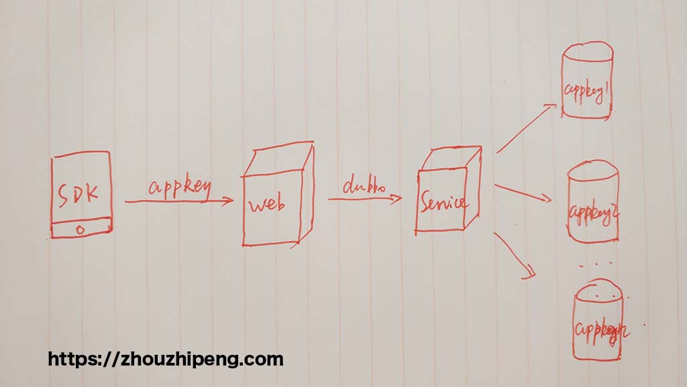
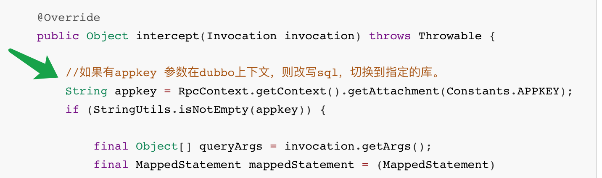
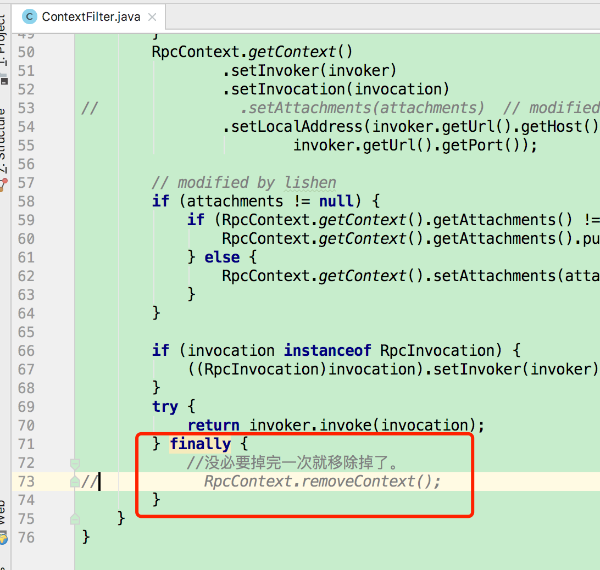
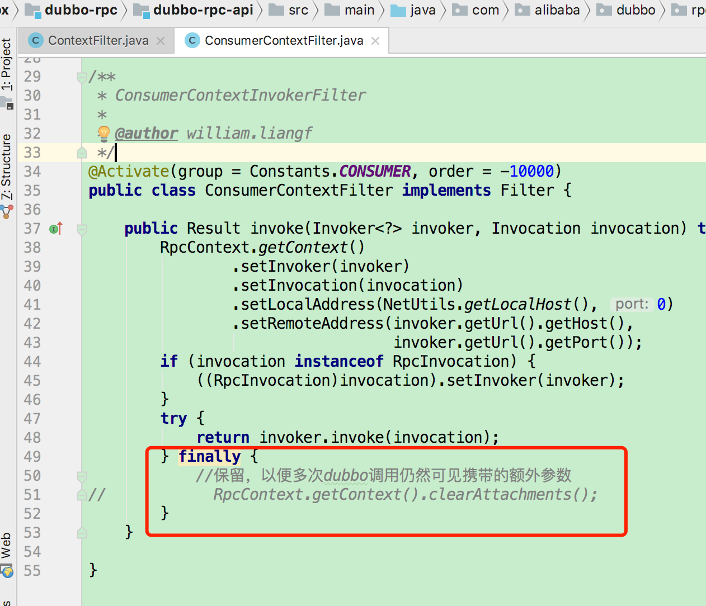

# 微服务下无侵入式动态路由数据库

## 背景

### 项目结构

项目主要采用  `springboot + dubbo + mybatis `框架，大体分为 `web` 和`service` 两层。 `web` 提供api接口给`sdk` 客户端使用， `service` 则提供mysql数据库表等操作，为`web` 提供`dubbo` 服务支持。


### 业务场景

简单看下这张图：




如图所示，大概流程为 ：sdk端传入appkey （某app的唯一标识),    web 端通过dubbo远程调用service，service 需要根据不同的appkey路由到不同的数据库。 每个appkey所代表的数据库的表结构都是一样的。


>  现在问题来了，appkey是非业务字段标识(表中不落地，仅在库名上体现)，如何在不改变原dao方法签名（无appkey入参）、service方法签名(无appkey入参)、mapper xml文件(无appkey标识)等的前提下，根据上报的不同appkey，在对应的数据库上执行sql操作？


## 解决方案

总结一下上面问题的要求：`如何无侵入的按key进行数据库路由?`

这里的“无侵入”涉及到两个难点：

1. web调service的时候如何可以不传入appkey 却将appkey带到service端？
2. 假设第一点ok，service端又如何能不显示改变数据源而在指定库上执行sql呢？


先考虑上述难点中的第二点：

### 思路一

关于mybatis的多数据源例子很多，但是并不太适合上述这种场景。 它需要先将多个数据源配置“写死”，在用到的具体dao方法上需要显式指定所使用的数据源。 它可能更适用于读写分离等场景，而对于本案例中的“动态” 数据源却显得力不从心！

### 思路二

数据源没办法很好的动态选择，是否可以动态创建数据源呢？答案是肯定的。但是这样一来会让架构更加复杂，不同的appkey下的sql需要使用不同的数据源来执行，一般情况下每个数据源都要维护一个连接池，如此一来，当appkey很多的情况下会很耗资源。所以动态创建数据源的方式不太可行！

### 可行方案

其实sql本身已经给了我们答案：

```sql
mysql> create database test;
Query OK, 1 row affected (0.01 sec)

mysql> create database test_1;
Query OK, 1 row affected (0.00 sec)

mysql> create table test.person(id integer,name varchar(100));
Query OK, 0 rows affected (0.27 sec)

mysql> create table test_1.person(id integer,name varchar(100));
Query OK, 0 rows affected (0.27 sec)

```


```sql
mysql> insert into test.person values(1,'zhou');
Query OK, 1 row affected (0.21 sec)

mysql> insert into test_1.person values(1,'zhou');
Query OK, 1 row affected (0.20 sec)

mysql> select * from test.person;
+------+------+
| id   | name |
+------+------+
|    1 | zhou |
+------+------+
1 row in set (0.00 sec)

mysql> select * from test_1.person;
+------+------+
| id   | name |
+------+------+
|    1 | zhou |
+------+------+
1 row in set (0.00 sec)
```


从以上过程可以看出，整个过程并没有使用`use test` 等任何切换数据库的命令，这意味着所有的sql操作都是在一个数据源中进行的（我登陆的是root用户,默认mysql库)。

由此一来，事情变得明朗化了，剩下的目标是：`改写sql，表名加上库名前缀`

恰好mybatis也是支持这种操作的，通过mybatis的拦截器, 示例代码（已验证过）如下：

```java
@Component
@Intercepts({
        @Signature(type = Executor.class, method = "update", args = {
                MappedStatement.class, Object.class}),
        @Signature(type = Executor.class, method = "query", args = {
                MappedStatement.class, Object.class, RowBounds.class,
                ResultHandler.class})})
public class MybatisInterceptor implements Interceptor {
    private static Log logger = LogFactory.getLog(MybatisInterceptor.class);


    static int MAPPED_STATEMENT_INDEX = 0;// 這是對應上面的args的序號
    static int PARAMETER_INDEX = 1;
    static int ROWBOUNDS_INDEX = 2;
    static int RESULT_HANDLER_INDEX = 3;


    @Override
    public Object intercept(Invocation invocation) throws Throwable {

        //如果有appkey 参数在dubbo上下文，则改写sql，切换到指定的库。
        String appkey = RpcContext.getContext().getAttachment(Constants.APPKEY);
        if (StringUtils.isNotEmpty(appkey)) {

            final Object[] queryArgs = invocation.getArgs();
            final MappedStatement mappedStatement = (MappedStatement) queryArgs[MAPPED_STATEMENT_INDEX];
            final Object parameter = queryArgs[PARAMETER_INDEX];
            final BoundSql boundSql = mappedStatement.getBoundSql(parameter);

            String sql = boundSql.getSql();

            String tableName = getTableName(sql);
            //将tablename加上指定数据库前缀
//        String dbname= DBSwitcher.getDBName();

            logger.info("old sql is :" + sql);


            String dbname = Constants.DB_PREFIX + appkey;
            if (StringUtils.isNotEmpty(tableName)) {
                sql = sql.replaceFirst(tableName, dbname + "." + tableName);

                logger.info("new sql is :" + sql);

                // 重新new一個查詢語句對像
                BoundSql newBoundSql = new BoundSql(mappedStatement.getConfiguration(), sql, boundSql.getParameterMappings(), boundSql.getParameterObject());
                // 把新的查詢放到statement裏
                MappedStatement newMs = copyFromMappedStatement(mappedStatement, new BoundSqlSqlSource(newBoundSql));
                for (ParameterMapping mapping : boundSql.getParameterMappings()) {
                    String prop = mapping.getProperty();
                    if (boundSql.hasAdditionalParameter(prop)) {
                        newBoundSql.setAdditionalParameter(prop, boundSql.getAdditionalParameter(prop));
                    }
                }
                queryArgs[MAPPED_STATEMENT_INDEX] = newMs;
            }

        }


        return invocation.proceed();
    }

    @Override
    public Object plugin(Object target) {
        return Plugin.wrap(target, this);
    }

    @Override
    public void setProperties(Properties properties) {

    }

    private MappedStatement copyFromMappedStatement(MappedStatement ms, SqlSource newSqlSource) {
        MappedStatement.Builder builder = new MappedStatement.Builder(ms.getConfiguration(), ms.getId(), newSqlSource, ms.getSqlCommandType());
        builder.resource(ms.getResource());
        builder.fetchSize(ms.getFetchSize());
        builder.statementType(ms.getStatementType());
        builder.keyGenerator(ms.getKeyGenerator());
        if (ms.getKeyProperties() != null && ms.getKeyProperties().length > 0) {
            builder.keyProperty(ms.getKeyProperties()[0]);
        }
        builder.timeout(ms.getTimeout());
        builder.parameterMap(ms.getParameterMap());
        builder.resultMaps(ms.getResultMaps());
        builder.resultSetType(ms.getResultSetType());
        builder.cache(ms.getCache());
        builder.flushCacheRequired(ms.isFlushCacheRequired());
        builder.useCache(ms.isUseCache());
        return builder.build();
    }

    public static class BoundSqlSqlSource implements SqlSource {
        private BoundSql boundSql;

        public BoundSqlSqlSource(BoundSql boundSql) {
            this.boundSql = boundSql;
        }

        public BoundSql getBoundSql(Object parameterObject) {
            return boundSql;
        }
    }


    // 根据sql获取表名
    private String getTableName(String sql) {
        String[] sqls = sql.split("\\s+");
        switch (sqls[0]) {
            case "select": {
                // select aa,bb,cc from tableName
                for (int i = 0; i < sqls.length; i++) {
                    if (sqls[i].equals("from")) {
                        return sqls[i + 1];
                    }
                }
                break;
            }
            case "update": {
                // update tableName
                return sqls[1];
            }
            case "insert": {
                // insert into tableName
                return sqls[2];
            }
            case "delete": {
                // delete tableName
                return sqls[1];
            }
        }
        return null;
    }
}
```

细心的你不难发现这一行：




至此其实上述两大难点中的第一点也几乎要解决了，没错，这里的`RpcContext` 对象就是[dubbo](https://blog.zhouzhipeng.com/?s=dubbo)为我们提供的一个工具，让你可以方便的在调用dubbo服务时传递上下文参数，其背后原理是基于`ThreadLocal` 进行包装。


service层的问题大体上已解决，现在web层的问题也相对简单了，写一个filter全局拦截appkey参数，放入dubbo上下文，其他所有controller 只要会调用dubbo服务就会将appkey参数带上。如下：

```java
 public void doFilter(ServletRequest request, ServletResponse response, FilterChain chain) throws IOException, ServletException {
        logger.info("过滤器正在执行...");
        // pass the request along the filter chain
        String appkey = ((HttpServletRequest) request).getHeader("key");

        logger.info("the requested appkey is :" + appkey);

        RpcContext.getContext().setAttachment(APPKEY, appkey);

        chain.doFilter(request, response);
    }
```


### 还差一点

以上的过程看似很完美了，但是由于dubbo的设计原因，事情并没有想象中那么顺利，为了方便说明，看下以下代码：

```java
/**
 * test接口
 */
@Controller
@RequestMapping(path = "/test")
public class TestController {

    private static final Logger LOGGER = LoggerFactory.getLogger(TestController.class);

    @Reference
    private TestService testService;

    @PostMapping(path = {"/test"})
    @ResponseBody
    public String hello() {

        // key 在请求头中，filter拦截后会放入dubbo RpcContext 上下文
        // 假设 当前默认数据源是 test库，而 key =  test_1

        boolean ret1=testService.method1();  // 在 test 库上执行

        boolean ret2=testService.method1();  // 在  test_1 库上执行


        return "hello";
    }
}
```

可以仔细看下上面我写的代码注释部分，以上结论是我试验过的。

在一个`controller` 中调用多次dubbo 服务其实是很普遍的，但是放入 `RpcContext ` 中的数据会在第一次调用`testService.method1()`  之后被销毁，第二次的dubbo调用时就获取不到了。而`filter` 也只会拦截一次controller。

前面说到，`RpcContext` 是基于java 原生`ThreadLocal` 设计，而`ThreadLocal` 是跟当前线程绑定的，而上面controller的hello方法在调完第一次的`testService.method1()` 之后，当前线程仍然是在的啊！看来数据并不是凭空消失的，这样一来应该是dubbo源码中显式的移除掉了上下文数据。

经过一番搜索+断点调试（限于篇幅，省略步骤），最终找到以下两处地方在销毁数据：







上面红框处的代码之前是未被注释的，有需要的朋友可以自行修改dubbo源码，放入私仓使用。

至此，一种微服务下的无侵入式动态路由数据库方案算是达成了！


## 总结

1. mybatis的 interceptor 确实很实用，改写sql、统计执行时间等，用处很大。
2. dubbo原本已经考虑到在远程调用中携带上下文参数了，用好这个可以做一些类似切面但更轻量的设计。


