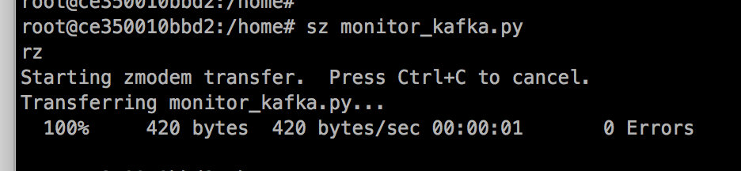
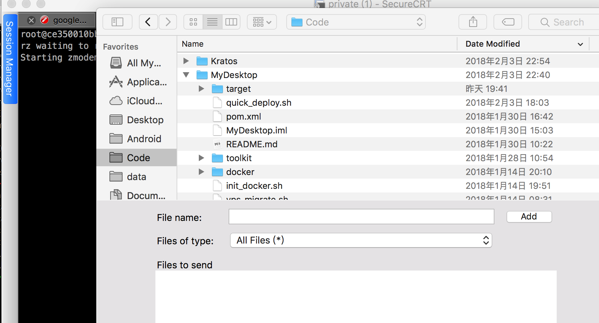

# linux系统上安装rz/sz 软件

有时候我们经常性的需要在linux机上上传或下载小文件之类的，这个时候通常的做法是开一个`ftp`软件进行传输，但是有时候比较麻烦， 一般另外一种比较好的方式是使用 `rz` `sz` 命令直接上传或者下载。

以下操作在`SecureCRT`演示:

## 下载及安装rzsz(分步）

```bash

# 1. 下载rzsz安装包
wget https://ohse.de/uwe/releases/lrzsz-0.12.20.tar.gz

# 2. 解压
tar zxvf lrzsz-0.12.20.tar.gz && cd lrzsz-0.12.20

# 3. 编译安装
./configure && make && make install

# 4. 创建软链
ln -s /usr/local/bin/lrz /usr/local/bin/rz
ln -s /usr/local/bin/lsz /usr/local/bin/sz

```

## 演示

1. 文件下载: 使用`sz your_filename` 就可以下载文件到你本机的目录（具体目录在`SecureCRT`中设置,如下图所示:



2.文件上传：直接使用`rz` 即可，会弹出如下文件框:



