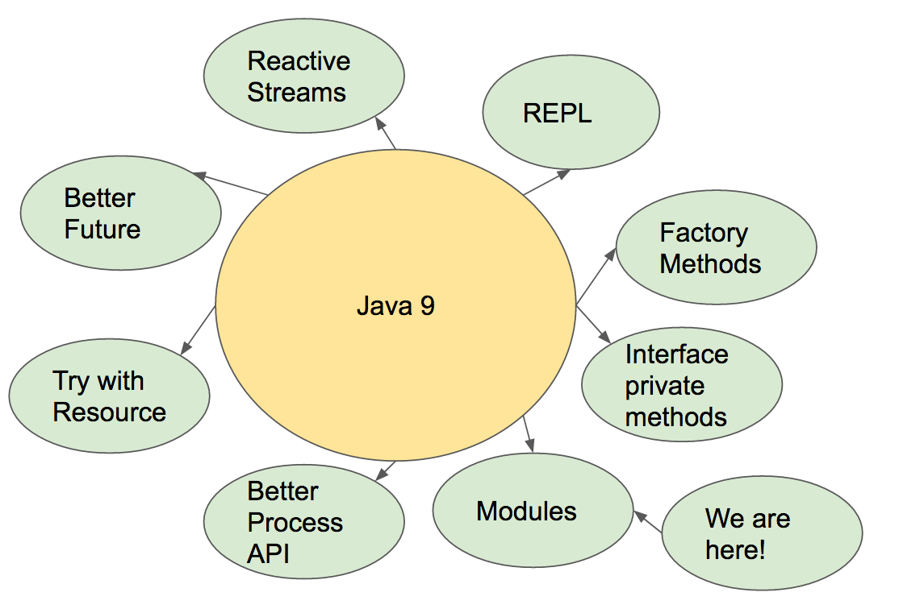

# 【译】Java9 (Part 1): 从零开始了解“模块化”

> 翻译自原文：https://dzone.com/articles/java-9-tutorial-step-by-step-from-zero-to-modules


我们都知道为什么`模块`是非常重要的。模块是微服务的基石！模块组织良好的应用程序的构建块。无论您是使用动态语言还是静态语言编写，模块都是您的应用程序的重要组成部分！模块强制执行单一责任原则。你可以调用每个函数一个模块，因为函数式编程是基于模块的。好吧，你懂的，模块是重要的，这就是为什么我们要在我们的教程的这一部分关注他们。



我们的计划：

* 第1步：从头开始下载Java 9并安装

* 第2步：概念：描述我们的模块文件名

* 第3步：概念：描述我们的模块文件路径

* 第4步：编写我们的模块描述符文件：module-info.java

* 第5步：添加代码到我们的模块

* 第6步：编译我们的模块

* 第7步：运行我们的模块


## 第1步：下载Java 9

转到：https://jdk9.java.net/download/并点击与您的操作系统相关的jdk。

下载后，只需点击它来安装（如果你是在MacOS上），并确认你已经安装了它：

```bash

tomerb@tomerb-mac.local:~$ java --version
java 9-ea
Java(TM) SE Runtime Environment (build 9-ea+164)
Java HotSpot(TM) 64-Bit Server VM (build 9-ea+164, mixed mode)
tomerb@tomerb-mac.local:~$ cd ~/tmp
tomerb@tomerb-mac.local:~$ mkdir -p ~/tmp/java9-modules
tomerb@tomerb-mac.local:~$ cd ~/tmp/java9-modules

```


## 第2步：模块文件名

在Java 9中，为了定义模块，您需要按照约定具有特定的文件名。是的，一个特定的文件名。这个文件名应该叫做：module-info.java。

## 第3步：模块文件路径

现在，你把module-info.java这个文件放在哪里？按照惯例，我们一般把它放在一个与你的模块名称相同的文件夹中。所以如果你的模块名是：

`com.me.mymodule`


那么你的module-info.java模块应该放在：

`src/com.me.mymodule/module-info.java` 路径.

明白了吗？ `<module-path> == <module name>` !   （模块路径等于模块名）


## 第4步：让我们编写一个模块
现在我们知道我们的模块文件名和我们的模块文件路径，让我们用一个命名和文件夹约定来编写一个模块：

```bash
tomerb@tomerb-mac.local:~/tmp/java9-modules$ mkdir -p src/com.me.mymodule
tomerb@tomerb-mac.local:~/tmp/java9-modules$ vi src/com.me.mymodule/module-info.java
```

```bash

module com.me.mymodule { }

```


就是这个！我们有一个模块了！ （没有真正有趣的实现，接下来就是了。）


## 第5步：添加一些代码到我们的模块！
在这一步中，我们将添加一些代码到我们的模块！所以让我们在模块的同一个文件夹中创建一个新的java文件。

```bash
$ mkdir -p src/com.me.mymodule/com/me/mymodule
$ vi src/com.me.mymodule/com/me/mymodule/Main.java
```


请注意我们放在我们的源代码中的文件夹名称。这很奇怪吗？我们首先输入模块所在的路径，然后为源代码创建完整的软件包名称。在这种情况下，`/ com / me / mymodule`位于`/com.me.mymodule`之上。这只是我们的源文件属于我们的模块，并且该模块已经在[Java 9](https://blog.zhouzhipeng.com/category/java)约定的标准模块目录中。

所以Main.java的源代码将是一个简单的Hello World源代码。

```java
package com.me.mymodule;
public class Main {
    public static void main(String[] args) {
        System.out.println("Hello World from Module! :)"); // nothing special here, standard java < 9 class.
    }
}

```

## 第6步：编译我们的模块
首先做mods目录（我们将进一步传递给：`java --module-path`）：

```bash

$ mkdir -p mods/com.me.mymodule
$ javac -d mods/com.me.mymodule \
          src/com.me.mymodule/module-info.java \
          src/com.me.mymodule/com/me/mymodule/Main.java

```

然后，我们交叉手指（期待），让编译器...编译！


## 第七步：运行我们的模块！
```bash
$ java --module-path mods -m com.me.mymodule/com.me.mymodule.Main
Hello World from Module! :)

```


## 总结
在这一部分，我们下载了Java 9，创建了一个模块，添加了一个源文件并运行它。我们看到在创建源代码时创建一个模块路径和类似的命名约定。

