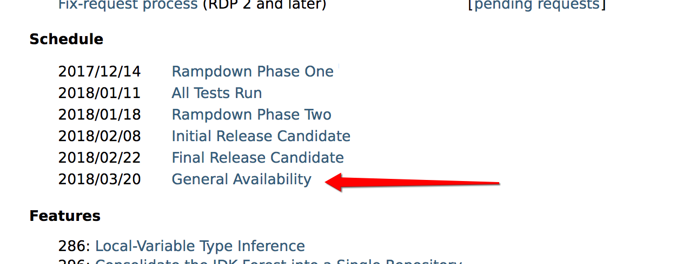
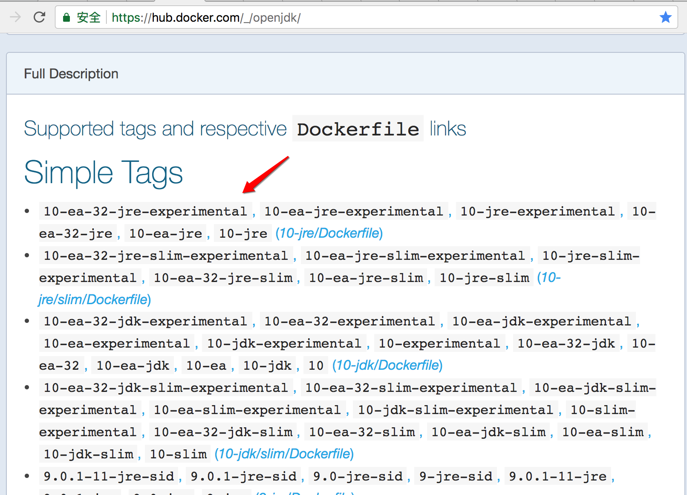
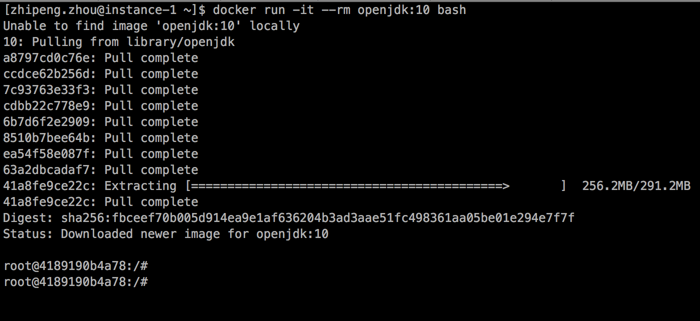

# 抢先体验java10的新特性之局部变量类型推断

## 前言
[java](https://blog.zhouzhipeng.com/tag/java) 历经风雨，从1995年诞生至今，已有近30多个年头了！java 一共有1-10块10个大版本了，当然java10还处于修复bug阶段，还没正式发布，第一个正式基本可用版在2018年的3.20号，让我们一起共同期待吧！：）

如下所示的java10计划表：




## 环境准备

为了快速能够体验下`java10`，选用[docker](https://blog.zhouzhipeng.com/tag/docker)环境是最好的 （不会安装[docker](https://blog.zhouzhipeng.com/tag/docker)环境的请参考我的另一篇文章：[走进docker的世界之入门篇](https://blog.zhouzhipeng.com/walk-in-docker-beginning.html)）。上`docker hub` 上瞅一瞅，看看有没有最新的`java10`的`tag`呢。


https://hub.docker.com/_/openjdk/




如上图所示，果然是有的! :)

好的，那么废话不多说，先跑起来看看吧！


## 运行Docker版Java10容器


使用如下命令即可运行并进入容器内部：

```bash
docker run -it --rm openjdk:10 bash
```

运行结果如图所示：（`docker run` 命令会先下载`openjdk`镜像)




进入容器后，先用`java -version` 看下版本：

```bash
root@4189190b4a78:/# java -version
openjdk version "10"
OpenJDK Runtime Environment (build 10+32-Debian-1)
OpenJDK 64-Bit Server VM (build 10+32-Debian-1, mixed mode)
```

可以看到，确实是`java10` 版本，那么就一起来逐个体验下哪些新特性吧！

根据openjdk官网描述 （http://openjdk.java.net/projects/jdk/10/）：

> 286: [Local-Variable Type Inference](http://openjdk.java.net/jeps/286)
> 296: [Consolidate the JDK Forest into a Single Repository](http://openjdk.java.net/jeps/296)
> 304: [Garbage-Collector Interface](http://openjdk.java.net/jeps/304)
> 307: [Parallel Full GC for G1](http://openjdk.java.net/jeps/307)
> 310: [Application Class-Data Sharing](http://openjdk.java.net/jeps/310)
> 312: [Thread-Local Handshakes](http://openjdk.java.net/jeps/312)
> 313: [Remove the Native-Header Generation Tool (javah)](http://openjdk.java.net/jeps/313)
> 314: [Additional Unicode Language-Tag Extensions](http://openjdk.java.net/jeps/314)
> 316: [Heap Allocation on Alternative Memory Devices](http://openjdk.java.net/jeps/316)
> 317: [Experimental Java-Based JIT Compiler](http://openjdk.java.net/jeps/317)
> 319: [Root Certificates](http://openjdk.java.net/jeps/319)
> 322: [Time-Based Release Versioning](http://openjdk.java.net/jeps/322)


这里我们挑几个看一看先体验下吧！


## 286. 局部变量类型推断

> 具体特性描述：http://openjdk.java.net/jeps/286

是的，你现在可以这样定义你的变量了！

```bash
var list = new ArrayList<String>();  // list变量被推断为 ArrayList<String>
var stream = list.stream();          // stream对象被推断为 Stream<String>
```

终于java也可以像其他动态语言一样简洁的定义变量了，对比java10之前，你只能这样写：

```bash
ArrayList<String> list = new ArrayList<String>();  // list变量被推断为 ArrayList<String>
Stream<String> stream = list.stream();
```


光说不练假把式！用`jshell` 敲两行命令试试:

```bash
root@cc23e6db2879:/# jshell
|  Welcome to JShell -- Version 10
|  For an introduction type: /help intro

jshell> var a=1
a ==> 1
```

看下`a`的类型，这里用`instanceof`关键字 （虽然基本类型用这个判断会报错，但是也能反观出其类型）

```bash
jshell> a instanceof Integer
|  Error:
|  unexpected type
|    required: reference
|    found:    int
|  a instanceof Integer
|  ^
```

注意上面的错误提示 `found :   int `  说明`a`确实已经被推断为`int`类型了。

再看看`String`类型的变量声明：

```bash
jshell> var str=new String("zhouzhipeng.com");
str ==> "zhouzhipeng.com"

jshell> str instanceof String
$2 ==> true

```

看着还不错，但实际这里的标识符`var` 并不是关键字！

> The identifier var is not a keyword; instead it is a reserved type name or a context-sensitive keyword. This means that code that uses var as a variable, method, or package name will not be affected; code that uses var as a class or interface name will be affected (but these names are rare in practice, since they violate usual naming conventions).

翻译过来的意思是：

标识符var不是关键字，而是一个保留类型名或上下文敏感关键字。这意味着使用var作为变量、方法或包名的代码不会受到影响；使用var作为类或接口名称的代码将受到影响（但这些名称在实践中很少见，因为它们违反了通常的命名约定）。

所以，我们这样声明一个变量也是可以正常编译的：

```bash
jshell> var var ="zhouzhipeng.com";
var ==> "zhouzhipeng.com"
```

但是下面这样声明一个类是不行的：

```bash
jshell> class var{}
|  Error:
|  'var' not allowed here
|    as of release 10, 'var' is a restricted local variable type and cannot be used for type declarations
|  class var{}
|        ^
```


## 使用限制

当然除此之外`var`还有一些其他使用限制，快速过一下：

1.使用`var`声明变量时必须有初始值

```bash
jshell> var x;
|  Error:
|  cannot infer type for local variable x
|    (cannot use 'var' on variable without initializer)
|  var x;
|  ^----^
```

2.`var` 声明的必须一个显式的目标类型，比如不可以用在`lamdba`变量或数组变量上

```bash
jshell> var f = () -> { };
|  Error:
|  cannot infer type for local variable f
|    (lambda expression needs an explicit target-type)
|  var f = () -> { };
|  ^----------------^

jshell> var k = { 1 , 2 };
|  Error:
|  cannot infer type for local variable k
|    (array initializer needs an explicit target-type)
|  var k = { 1 , 2 };
|  ^----------------^

```

3.`var`声明的变量初始值不能为`null`


```bash
jshell> var g = null;
|  Error:
|  cannot infer type for local variable g
|    (variable initializer is 'null')
|  var g = null;
|  ^-----------^

```

4.`var`不能声明不可表示的类型，包括：null类型，交叉类型（概念参考：https://www.w3cschool.cn/java/java-intersection-type.html） 以及匿名类类型

说明：

这一块比较晦涩且不太常见, 在我没彻底弄清楚之前不方便做过多解释以免误导大家，具体可参见官方原文对“不可表示”类型的描述：

 http://openjdk.java.net/jeps/286  文章定位到“Non-denotable types” 描述处


## 结语

以上是关于java10的新特性：局部变量类型推断的体验和说明，更多其他特性请继续关注本博客 blog.zhouzhipeng.com


> 参考文献
> http://openjdk.java.net/projects/jdk/10/
> https://hub.docker.com/_/openjdk/