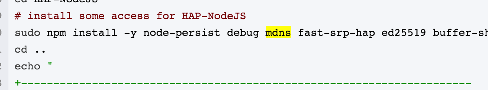
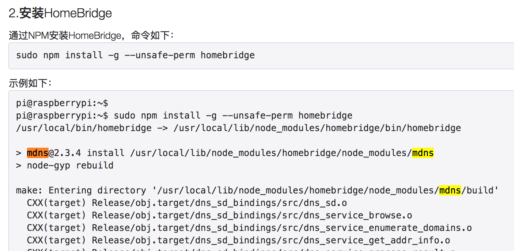
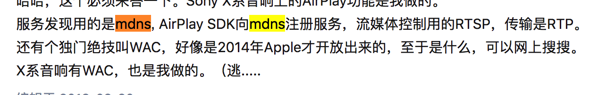

# mDNS协议应用场景研究汇总

## 简介

mDNS multicast DNS , 使用5353端口，组播地址 224.0.0.251。在一个没有常规DNS服务器的小型网络内，可以使用mDNS来实现类似DNS的编程接口、包格式和操作语义。MDNS协议的报文与DNS的报文结构相同，但有些字段对于MDNS来说有新的含义。

每个进入局域网的主机，如果开启了mDNS服务的话，都会向局域网内的所有主机组播一个消息，我是谁，和我的IP地址是多少。然后其他也有该服务的主机就会响应，也会告诉你，它是谁，它的IP地址是多少。mDNS的域名与普通DNS的域名是通过后缀.local区分开来的。如果一台终端需要访问一个mDNS域名，他就会向局域网内发送组播，询问该域名的IP是多少。

例如：

一个设备接入网络，首先查询名称是否冲突，并通告当前服务器信息

冲突检测结束后，发送MDNS通告，通知其它设备更新DNS缓存

其它设备对该域名访问时，会发起MDNS查询

## 应用场景

### 1. 中继配置(网关应用)

定义

传统的基于TCP/IP协议的通信模式下，如果设备之间需要通信，必须知道对端设备的IP地址。由于IP地址不好记忆，为了便于记忆和提升可用性，网络管理员可以配置DNS服务以方便其他设备通过域名访问。这样，当一个设备通过域名访问其他设备时，还需要在设备上配置DNS服务器用来解析域名对应的IP地址。为了减少网络设备的手工配置成本，苹果公司提出了零配置网络Zeroconf（Zero-configuration networking）。

零配置网络是指网络设备在不需要管理员参与配置的情况下，实现自动地址配置、域名解析和服务发现，广泛应用在家庭无线网络和企业办公网络中。Bonjour技术是由苹果公司提出的基于组播域名系统mDNS（Multicast Domain Name System）和基于DNS的服务发现协议DNS-SD（DNS-Based Service Discovery）协议的零配置网络技术的解决方案，是一种应用在二层广播域的技术，实现二层广播域内网络设备自动获取地址和发现服务。大部分苹果产品（例如iPhone、iPad、Apple TV等）都支持Bonjour技术。

Bonjour技术仅能实现同VLAN内的服务发现，为了实现跨VLAN和跨网段的服务发现，华为公司提出了mDNS网关和mDNS中继的解决方案。mDNS中继负责转发Bonjour设备（支持Bonjour技术的用户终端或服务提供设备）与mDNS网关之间的mDNS报文。这样，支持Bonjour技术的用户终端可以实现跨网段的打印机和Airplay服务发现。

目的

使用Bonjour技术的服务提供设备（例如Apple TV）通过组播地址（IPv4地址为224.0.0.251）在网络中宣布自己可以提供的服务。用户终端设备（例如iPhone、iPad等客户端）通过发送目的组播地址为224.0.0.251的mDNS请求报文请求本地网络中的可用服务。一方面实现了网络中的服务共享，另一方面方便客户端能够访问网络中的服务资源。

然而，mDNS协议进行信息交互时使用的目的组播地址（224.0.0.251）仅在二层广播域生效，即只能在同一VLAN内转发，不能实现跨VLAN或跨三层设备转发。如[图6-1](http://support.huawei.com/enterprise/docinforeader!loadDocument1.action?contentId=DOC1000049740&partNo=10062#dc_fd_mdns_000101)所示，通常企业网络会规划多个VLAN或多个网段，Apple TV_1、Apple TV_2和Printer分别处于不同网段。位于VLAN10中的iPhone只能发现本VLAN内的Apple TV_1的服务；不能发现位于VLAN20的Apple TV_2服务和AC下挂的Printer服务。

图6-1  mDNS网关应用组网图

### 2. google 物联网框架weave

Google Weave框架 （参考： [http://www.uml.org.cn/xjs/201611012.asp](http://www.uml.org.cn/xjs/201611012.asp))

Weave Local API采用mDNS协议解决第一个问题。我们知道，DNS协议用于完成计算机名字与IP地址之间的解析。在访问互联网的时候，用户一般在浏览器内输入待访问的网站的域名，本质上是一台服务器的名字。浏览器会查询DNS服务器，把服务器的名字转换成对应的IP地址，然后才通过TCP/IP协议与该服务器建立连接，并下载网页。这个过程需要一个重要角色-DNS服务器的支持。DNS服务器一般存在于具有成百上千台计算机的大型网络中，同时需要网络管理员进行复杂的管理和配置。在家庭网络等这类小型网络中，一般没有DNS服务器，因此无法采用传统的DNS协议来解析Weave设备的IP地址。而mDNS协议是专门为家庭网络等小型网络设计的。在mDNS架构中，无需集中的DNS服务器，只要终端设备都在一个局域网内（严格来说，应该是一个广播域内），且支持mDNS协议，就可以相互解析IP地址，并完成点对点通信。

因为没有集中的DNS服务器，运行mDNS协议的终端之间是通过组播（可以理解为广播）来相互交流的。智能手机客户端知道Weave设备的名字（通过注册机制完成，并记录在智能手机客户端中），它会发送一个mDNS请求广播，请求中包含了目标设备的名字。这个广播请求被所有在同一个局域网内的设备收到，但是只有请求的名字与自己的名字匹配的设备，才会向智能手机客户端回应一个应答。这个应答中包含了自己的IP地址。于是智能手机客户端就知道了Weave设备的IP地址，后续就可以基于普通的TCP/IP协议进行通信了。

### 3.智能家居（HomeKit）

https://blog.csdn.net/kxwinxp/article/details/78434062

http://wiki.yinhh.com/Wiki.jsp?page=HomeBridge

### 4. Airplay 协议基础

https://www.zhihu.com/question/20446987/answer/153186975

## 总结

mDNS作为没有中央DNS服务器的局域网内协议补充，应用场景还是很广泛的。而且基本上现在的智能手机、pc等都已自带该协议，客户端代码无需引入第三方sdk包即可基于该协议进行开发。