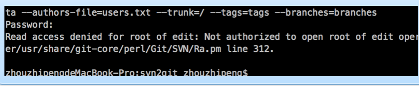

# svn迁移到git 操作指南

## 前言
本操作指南假设你对`git`以及`svn`已经有些了解，从svn无缝迁移到gitlab私有仓库中， 将保留所有提交的`commits`以及提交的`log` 等。

## 在gitlab中新建对应名称的项目
 请注意建好group，并在profile设置中加入自己本机的ssh-key

 ## 以appinfo-service为例迁移
 ```bash
 git svn clone svn://ip/LocalService/appinfo-service --no-metadata --authors-file=users.txt --trunk=/ --tags=tags --branches=branches
cd  appinfo-service
git remote add origin git@ip:mob-localservice/appinfo-service.git
git push -u origin master

```

users.txt 为svn用户到git用户的一个映射关系，可参考如下：

```bash
username = zhouzhipeng <admin@zhouzhipeng.com>

```

## 优化目录结构
```bash
mv trunk/* .

rm -rf trunk

git add .

git commit . -m "移除trunk目录"

git push
```


## 问题解决
执行第一个git  svn clone 命令时如果报错如下：



 解决参考：http://stackoverflow.com/questions/22103378/importing-read-only-subversion-to-git-blocked-by-read-access-denied-for-root-of


