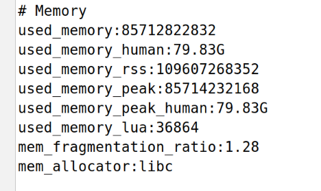
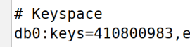
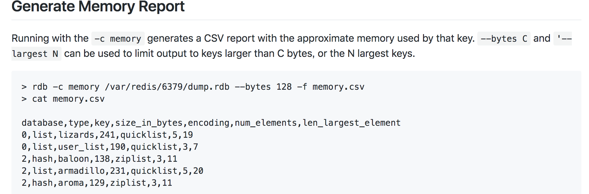

# Redis内存空间简单分析

## 背景

最近发现项目中用的`redis` 内存消耗很大（但是印象中却以为没有这么多的key的内存消耗才对呀？），使用`info`命令可以看到所有key占用的一些内存大小以及key的数量等等，如下图所示(只截图了memory和keyspace部分)：







可以发现，`info`命令只能看到总的内存大小以及key的数量等。这些对于分析到底哪些或哪类key占用的内存较大是远远不够的！


## 工具调研

工欲善其事必先利其器！

在各种google搜索之后，发现有一个工具貌似是可以的:[redis-rdb-tools](https://github.com/sripathikrishnan/redis-rdb-tools)  。

于是分头行动，

  1. 让运维将线上rdb快照文件用scp拷贝到一台测试机上（毕竟在线上机器上操作是不太安全的）
  2. 我需要用最快最干净的方式来安装一下rdb工具，这里选择直接在python docker中装。


## 分析之路

根据该工具[文档描述](https://github.com/sripathikrishnan/redis-rdb-tools#generate-memory-report),  可以将 rdb 快照文件转换为 csv 格式文件：




拿到csv文件后有两种做法，

1. 直接用python `pandas`库分块读取csv文件，可以做一些统计、过滤等操作（几乎有与等价于sql的api操作方式，具体操作可以参考这篇文章: [【分析篇】：Pandas像sql操作python 进行数据分析](https://www.jianshu.com/p/7d1d91ac7df3)。
2. 将csv导入到关系型数据库，用sql来操作，比较灵活 。关于数据库选型：在试验过mysql和postgres两款关系型数据库后，感触挺深， mysql单表导入完上面csv中大概3亿多条数据后，查询直接瘫痪！postgres导入数据后依然坚挺（平均一条like 查询十几秒左右，还是可以接受的！）。


## just try！

### rdb 文件转换为csv

(这里因为是操作的内部的业务数据，有些数据细节不便公开，仅贴出相关重要命令以及一些踩坑后的经验方法等)

```bash
# 1. 先运行一个python docker容器(注意将rdb文件挂载进去)
docker run  -it -v YOUR_PATH/xxx.rdb:/data/xxx.rdb  python bash

# 2. 安装rdb tools
pip install rdbtools python-lzf

# 3. 执行rdb 转为csv命令 (此过程根据rdb文件大小时间不定)
rdb -c memory /data/xxx.rdb  -f memory.csv


```

上述命令中有些路径和名称注意替换为你自己真实的值。


### csv 简单清洗

话说这里也是个坑来着，在往`postgres`数据库导入csv数据时，报了一个大概意思是 “实际的列个数和期待的列个数不匹配”错误。 可能rdb tools在转换的时候某些行的值有点问题，或者其他bug导致。 这里鉴于有异常的数据条数不多，不用太过于深究，直接用`pandas` 简单清洗一下即可。

相关python代码如下：

```python
import pandas as pd
import numpy as np


reader = pd.read_csv('/xxxx/memory.csv', iterator=True,error_bad_lines=False)

loop = True
chunkSize =10000000
chunks=[]

total_bytes=0

while loop:
    try:
        chunk = reader.get_chunk(chunkSize)
        chunks.append(chunk)
    except StopIteration:
        loop = False
        print("Iteration is stopped.")

df = pd.concat(chunks, ignore_index=True)

df.to_csv('/xxx/memory2.csv', sep=',', encoding='utf-8')
```

大概解释下，这里先读取csv文件，指定选项`error_bad_lines=False` ，则pandas会自动忽略有问题的行。接着用分块的方式读完所有内容，最后合并然后写到新文件。


### csv导入postgres

此步骤其实理论上非必须的，上文说到其实可以直接用 `pandas`操作csv几乎可以完成跟sql类似的分析效果。 但比较还是直接用sql比较方便，还是导到数据库来的实惠。

```bash
# 1. 运行postgres docker容器(记得把上面步骤中转换得到的csv文件挂载进去)
docker run --name postgres -v /xxx/memory2.csv:/memory.csv   -d postgres:9.6

# 2. 进入postgres容器内部 psql shell
docker exec -it postgres psql -U postgres

# 3. 创建临时表 (建议是所有字段是用text，否则导入可能会遇到转型错误，第一个字段index是pandas带进来的，可以导出csv时处理下)
postgres=# create table keys_dump(
index integer,
database text,
type text,
key text,
size_in_bytes text,
encoding text,
num_elements text,
len_largest_element text,
expiry text
);


# 4. 执行导入csv文件命令
postgres=# COPY keys_dump FROM '/memory.csv' WITH csv;


```


### sql分析

现在问题会比较简单了，这里因为key中涉及到一些实际业务值，下面只是简单列举一下比如统计`string`  类型的key占用的总内存大小：

```sql
select sum(size_in_bytes::int) from keys_dump where type='text';
```

诸如此类的sql，根据你的实际场景，比如按key中某关键词进行like查询:

```sql
select sum(size_in_bytes::int) from keys_dump where type='text' and key like 'xxxx%';
```

或者来个统计单key大小前10条：

```sql
select *  from keys_dump order by size_in_bytes::int desc limit 10;
```


以上sql语句，我自己都试过，在单表3亿多的行数中执行，总时间大概10几到二十几秒左右，整体速度还是让人能接受的，毕竟只是做下离线分析。


## 总结

以上仅提供redis内存分析的一个简单思路，大体是： rdb--> csv --> sql  。如果你有更好的方式，欢迎在文章下方评论留言！


