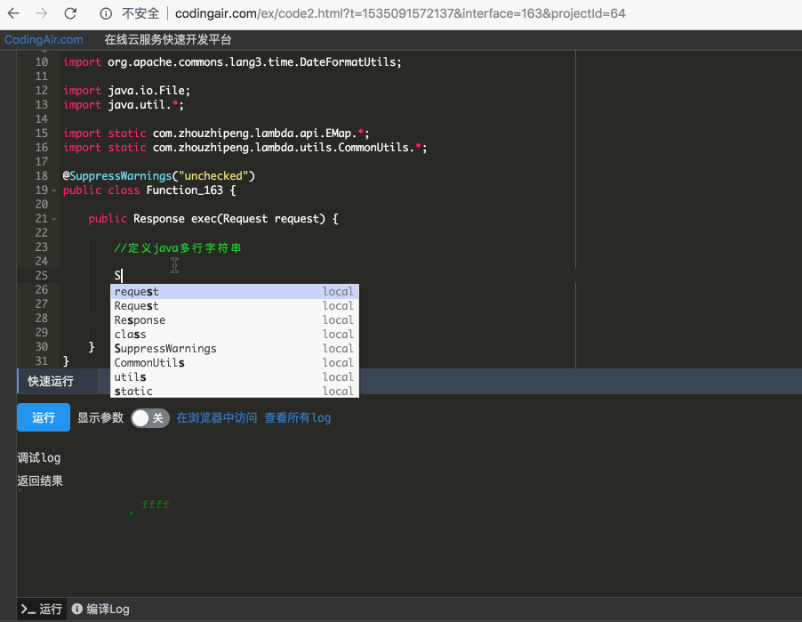
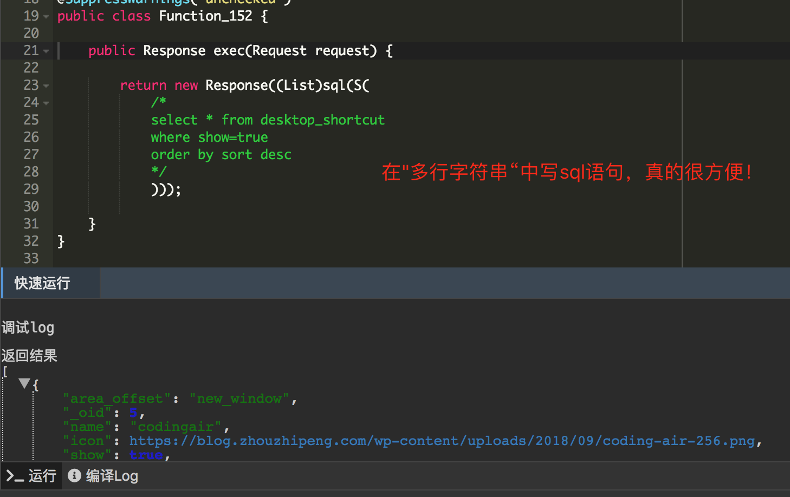
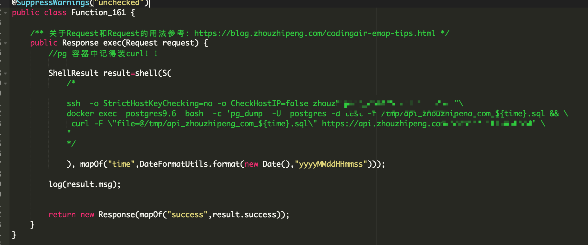

# 如果java也有多行字符串该多好？！

用过`python` 的人应该知道，在`python`中可以定义多行字符串 ，可以这样写：

```python
multiline_str="""
第一行
第二行
...

"""
```


看着很爽啊，其他语言如`javascript`也有类似的 ：

```javascript
let multiline_str=`
第一行
第二行
...

`
```


然而唯独我们牛逼的`java` 却没有这种语法！所以在java中你一般只能这样写“多行” 字符串：

```java
      String multiline_str="第一行\n" +
                "第二行\n" +
                "...";

```

看着多少有点...   很傻的感觉！ （一堆换行符和+号）


难道真的只能就这样妥协了吗？ 不！

请看下面的实现：




在线代码演示地址： [http://codingair.com/ex/code2.html?t=1535091572137&interface=146&projectId=17](http://codingair.com/ex/code2.html?t=1535091572137&interface=146&projectId=17)


对的，你没看错，确实是在java多行注释中实现的“多行字符串”功能，这是一个trick （小技巧，并不是编译器级别实现）， 但是的确很实用 ！

试想一下你的sql如果可以这样写：




再试想下可以这样直接写 shell 命令：




一切是不是都太爽了有木有！

可以到这个网站体验更多特性功能： [http://codingair.com](http://codingair.com)


揭秘时刻！

那么这个小的trick是如何实现的呢？直接附上上述例子中`S`函数的源码：

```java
	/**
     * 多行字符串
     * 入参括号中传入，使用 /* ....* /  形式注释
     *
     * @return
     */
    public static String S() {
        String javaSource = threadLocal.get();
        try {
            StackTraceElement element = new RuntimeException().getStackTrace()[1];
            byte[] bytes = javaSource.getBytes("UTF-8");
            String s = convertStreamToString(new ByteArrayInputStream(bytes, 0, bytes.length), element.getLineNumber());
            return s.substring(s.indexOf("/*") + 2, s.indexOf("*/"));
        } catch (Exception e) {
            e.printStackTrace();
        }

        return null;
    }
```


解释一下，你会注意到该函数第一行有这样一行代码：

```java
String javaSource = threadLocal.get();
```

没错，这里是在获取调用`S` 函数的所在类的源码，通过`ThreadLocal`对象传递。


至此，是不是有种恍然大明白的感觉？！ 可以到这个网站体验更多特性功能： [http://codingair.com](http://codingair.com) 有任何问题或疑问欢迎在博客下方评论留言。


