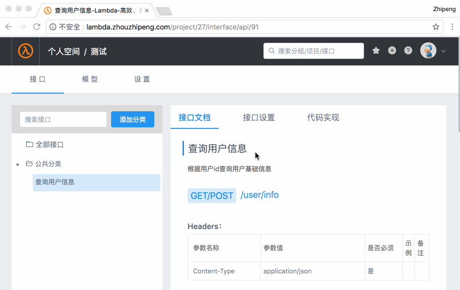

## 在线托管访问

你可以直接访问Lambda4J在线demo地址在线使用体验: [Lambda4J](https://lambda.zhouzhipeng.com)




## 独立部署

* 以下命令需要在docker环境下执行，且尽量保证以下端口未被占用： `5432` ,`6379` , `27017` ,`8080`, `3000`. 

```bash
# 一键部署脚本(会启动5个跟lambda4j平台相关服务容器)
curl -sSL https://zhouzhipeng.com/lambda/scripts/quick_start.sh | bash

# 一键清理脚本(停掉上面快速部署脚本中启动的所有服务！慎用)
curl -sSL https://zhouzhipeng.com/lambda/scripts/clear.sh | bash
```


当你看到如下输出时，表示服务都启动正常！

```bash
Congratulation! Running success! visit: http://localhost:3000 ,login with user: admin@zhouzhipeng.com and password: 123456
```


## 教程视频

### youtube地址：[https://youtu.be/rJYOiO00tnw](https://youtu.be/rJYOiO00tnw)

###  爱奇艺地址： [http://www.iqiyi.com/w_19s354u9f5.html](http://www.iqiyi.com/w_19s354u9f5.html)

